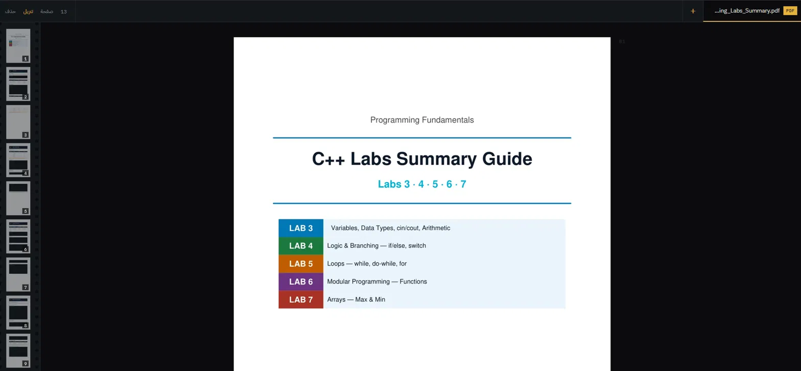

# وَرَقَة

عارض ملفات في المتصفح. تَرفع الملف، فتحصل على رابط يفتحه أي زائر ويقرأه في مكانه — دون تنزيل، ودون برنامج خارجي، **ودون سطر جافاسكربت واحد**.

<!-- TODO: ضع لقطة شاشة للعارض هنا:
     
     التقطها بمفتاح Win+Shift+S، واحفظها في مجلد docs -->

المدعوم: `.pdf` · `.png` · `.jpg` · `.jpeg` · `.webp` · `.gif` · `.txt` · `.md` · `.csv`

---

## القرارات التقنية

هذا القسم هو لبّ المشروع. كل قرار هنا كانت أمامه بدائل أسهل، واخترتُ ما اخترت لسبب.

### ١. العرض المضمّن بدل التنزيل

قرار المتصفح — أيعرض الملف أم ينزّله؟ — لا يُتخذ في HTML، بل في ترويسات استجابة HTTP:

| الترويسة | القيمة | الأثر |
|---|---|---|
| `Content-Type` | `application/pdf` | يعرف بماذا يفتح الملف |
| `Content-Disposition` | `inline` | يعرضه؛ ولو كانت `attachment` لنزّله |
| `Accept-Ranges` | `bytes` | يقرأ الملف على أجزاء لا دفعة واحدة |

المساران `/file/<id>` و`/download/<id>` متطابقان إلا في وسيط واحد: `as_attachment`.

### ٢. التحويل على الخادم بدل PDF.js

البديل المعتاد أن ترسم صفحات PDF في متصفح الزائر عبر PDF.js. رفضتُه لأنه يفرض جافاسكربت.

فصارت صفحات PDF تتحوّل إلى صور WebP **مرة واحدة عند الرفع** عبر PyMuPDF، ويعرضها المتصفح صورًا عادية:

| المهمة | لو استُخدمت جافاسكربت | هنا |
|---|---|---|
| رسم الصفحات | PDF.js في متصفح كل زائر | PyMuPDF مرة واحدة عند الرفع |
| التحميل التدريجي | `IntersectionObserver` | `loading="lazy"` الأصلية في HTML |
| حجز ارتفاع الصفحة | `aspect-ratio` تضبطها جافاسكربت | وسما `width` و`height` من الخادم |
| الانتقال بين الصفحات | `scrollIntoView` | روابط مرساة `#page-3` |

### ٣. طبقة نص شفافة لا مخفية

تحويل الصفحة إلى صورة يقتل البحث والنسخ وقارئات الشاشة. الحلّ طبقة من مقاطع النص فوق الصورة بـ `color: transparent`.

ولماذا ليست `display: none` أو `visibility: hidden`؟ لأنهما يُخرجان النص من متناول `Ctrl+F` ومن قارئات الشاشة معًا.

وتُخزَّن مواضع المقاطع **نسبًا مئوية** لا بكسلات، لأن الصورة تتمدّد مع عرض الشاشة. أما حجم الخط — وهو لا يقبل النسبة المئوية — فيُقاس بوحدة `cqw` عبر استعلامات الحاويات.

### ٤. سلاسة التمرير

- تمرير المستند نفسه لا حاوية `overflow` داخلية
- ارتفاع كل صفحة معروف قبل تحميلها، فلا يقفز شريط التمرير
- لا `backdrop-filter` في الأشرطة الثابتة — التمويه الزجاجي يُعاد رسمه مع كل إطار
- `scroll-behavior: smooth` للانتقال بين الصفحات، معطَّلة عند `prefers-reduced-motion`

### ٥. الأمان

- **Path Traversal:** أسماء الملفات تُطابَق بتعبير نمطي صارم، ويُتحقّق أن المسار المحلول داخل مجلد الرفع
- **XSS مخزَّن:** `.html` و`.svg` مستبعدان عمدًا — كلاهما ينفّذ جافاسكربت من نطاقك
- **الحذف عبر POST لا GET:** أي زاحف أو معاينة رابط كانت ستمسح الملفات
- ترويستا `X-Content-Type-Options: nosniff` و`Content-Security-Policy: sandbox` على كل ملف مُقدَّم

### ٦. الأسماء العربية

`secure_filename` من werkzeug تحذف كل حرف غير لاتيني، فيتحوّل «تقرير المشروع.pdf» إلى «.pdf». استبدلتُها بدالة تنظيف تحفظ نطاق الحروف العربية.

---

## التشغيل

```bash
py -m venv .venv
.venv\Scripts\activate
py -m pip install -r requirements.txt
python app.py
```

ثم `http://127.0.0.1:5000`.

> **ملاحظة:** يحتاج المشروع نسخة بايثون القياسية. النسخة عديمة القفل العام (free-threaded) لا تتوفّر لها عجلات PyMuPDF جاهزة.

---

## البنية

```
waraqa/
├── app.py              # المسارات وترويسات HTTP
├── pages.py            # تحويل PDF إلى صور + استخراج طبقة النص
├── templates/
│   ├── base.html
│   ├── index.html      # صفحة الدخول والرفع
│   ├── view.html       # العارض
│   └── confirm.html    # تأكيد الحذف
├── static/css/style.css
├── uploads/            # الملفات الأصلية
└── pages_out/          # الصور المشتقّة والسجل
```

---

## ما لم يُنجَز بعد

المشروع يعمل محليًا، لكنه **غير جاهز للنشر العام**:

- [ ] مصادقة تحرس الرفع والحذف — أي زائر يستطيع الحذف حاليًا
- [ ] `debug=False` وتشغيل عبر `waitress` بدل خادم التطوير
- [ ] سقف لعدد الملفات وحجمها الكلي
- [ ] نقل التحويل إلى مهمة خلفية — ملف كبير يُجمّد الطلب حاليًا
- [ ] تخزين دائم أو خدمة كائنات؛ أقراص المنصات المجانية مؤقتة
- [ ] OCR للملفات المصوّرة ضوئيًا — طبقة نصها فارغة

## المقايضة الوحيدة

محاذاة طبقة النص **تقريبية**. عارضات PDF التي تعمل بجافاسكربت تقيس عرض النص المرسوم ثم تمطّه ليطابق الأصل بالبكسل، وهذا القياس مستحيل بلا جافاسكربت. لا يظهر الأثر عمليًا لأن النص شفاف، لكنه يبين قليلًا عند التحديد.
